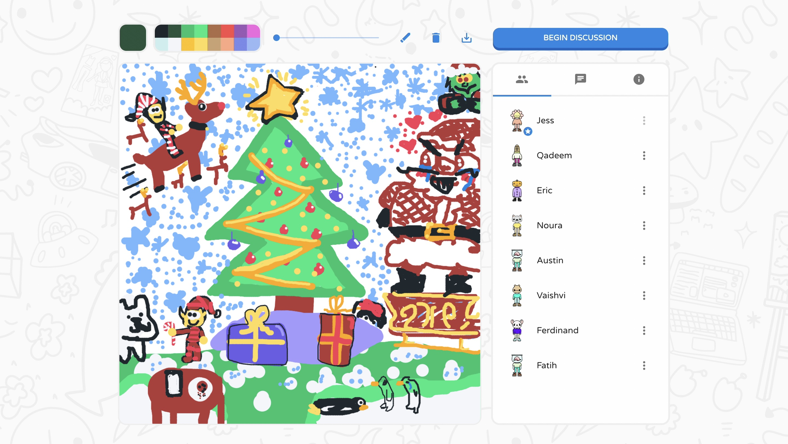

# artfair

a collaborative drawing experience for improving interpersonal skills

## About

ArtFair is an online collaborative drawing experience centered around the idea of a shared canvas where team members may work together to create pieces of art. ArtFair facilitates team building through several fun activites that focus on various interpersonal skills, discussion questions that spark reflective conversation, and tangible artifacts that serve as lasting memories of the experience.



## Prerequisites

- Make sure you have [Node](https://nodejs.org/), [Yarn](https://yarnpkg.com/), and [git](https://git-scm.com/) installed on your machine.
- We also recommend using [Visual Studio Code](https://code.visualstudio.com/) with the [ESLint](https://marketplace.visualstudio.com/items?itemName=dbaeumer.vscode-eslint) extension.

## Running the Project

1. Install the dependencies and devDependencies:

   ```sh
   yarn
   ```

2. Serve the app locally in development mode:

   ```sh
   yarn full-dev
   ```

## Scripts

`yarn client-dev` : build the unoptimized client bundle and serve it with hot reload at <http://localhost:1234>

`yarn client-build` : build the optimized client bundle for distribution

`yarn client-clean` : delete all client build artifacts

`yarn common-dev` : compile the common package in watch mode

`yarn common-build` : compile the common package for distribution

`yarn common-clean` : delete common distribution package

`yarn server-dev` : start the server with hot reload

`yarn server-build` : compile the server package for distribution

`yarn server-start` : start the server without hot reload

`yarn server-clean` : delete server distribution package

`yarn full-dev` : run dev scripts for client, common, and server

`yarn full-start` : build the client bundle and start the server

`yarn full-clean` : delete build artifacts for client, common, and server

## Development

1. Get the latest changes from the `dev` branch:

   ```sh
   git checkout dev
   git fetch && git pull
   ```

2. Make sure your dependencies are up to date:

   ```sh
   yarn
   ```

3. Create a local feature branch off of `dev` to work on your task:

   ```sh
   git checkout -b feature/<new-branch-name>
   ```

   where `<new-branch-name>` is a short name for your task in lower kebab-case.

   Ex: My task is to add canvas drawing functionality so my branch is called `feature/canvas-drawing`

4. Push your local feature branch to the remote repository:

   ```sh
   git push -u origin feature/<new-branch-name>
   ```

5. Create/Edit/Delete files as necessary to complete your task.

6. Stage your new, modified, or deleted files:

   ```sh
   git add -A
   ```

7. Commit your staged changes:

   ```sh
   git commit -m <message>
   ```

   where `<message>` is a short imperative statement describing your changes. The message should (ideally) start with a capital letter and end without a period.

   Ex: I wrote code to enable the user to draw on the canvas so my commit message would be `"Enable user to draw on canvas"`.

8. Push your commit(s) to your remote branch:

   ```sh
   git push
   ```

9.  Once you have completed your task and pushed all commits to your remote brach, create a **Pull Request** on GitHub to merge your feature branch into the `dev` branch. Give the pull request a short imperative title reflective of your task.

    Ex: My task is to add canvas drawing functionality so my pull request is titled `Add canvas drawing functionality`.

10. Add at least one programmer as a reviewer for your pull request. If any changes are requested by the reviewer(s), just commit those changes and the pull request will automatically include those changes.

11. Once your pull request is approved by the reviewer(s), you may merge the pull request into `dev`.

## Deployment

1. Clone the repository.

2. Run the deploy script on the appropriate hostname and port:

   ```sh
   ./deploy.sh <hostname> <port>
   ```
